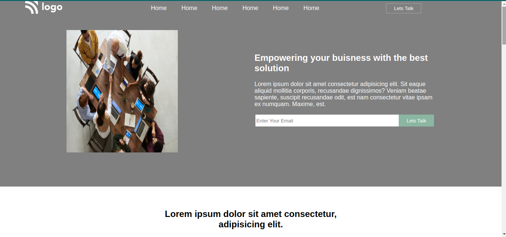
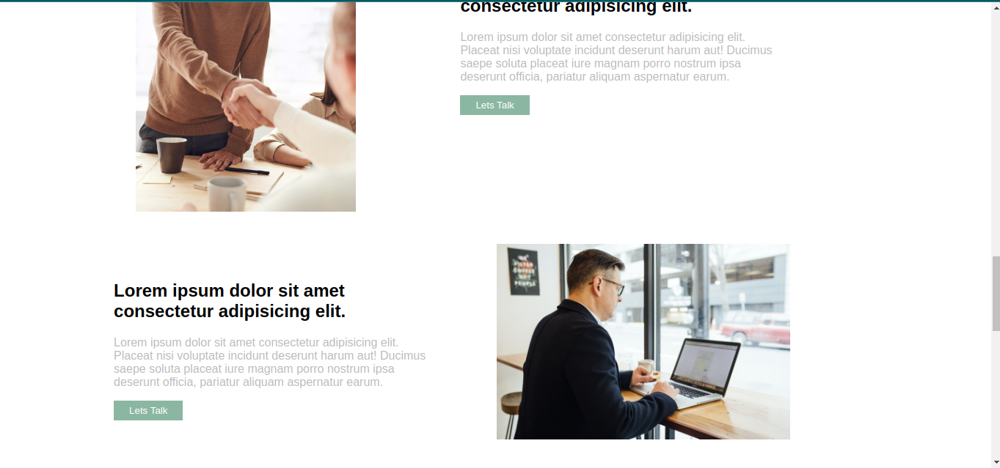
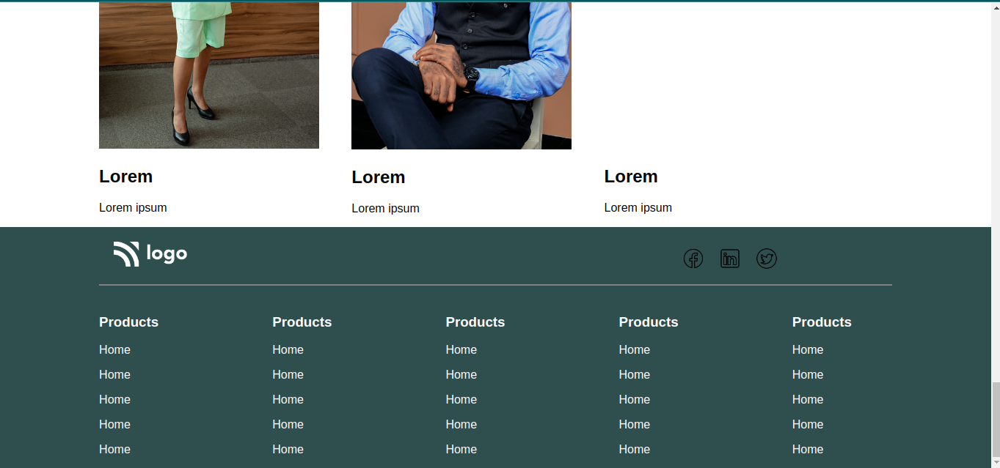
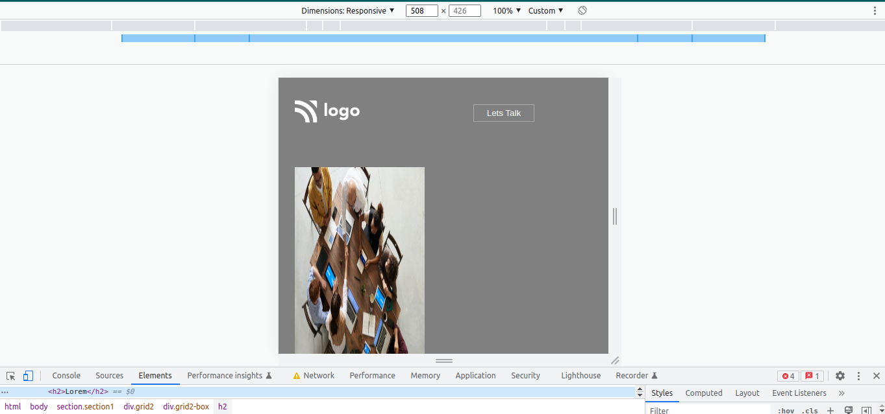
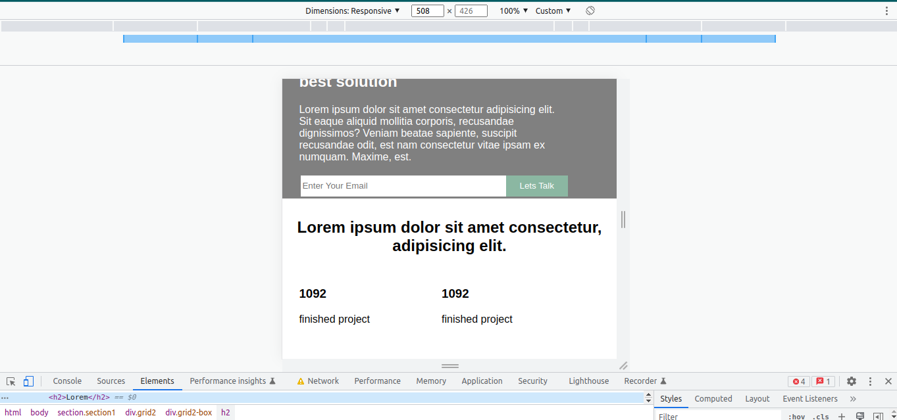
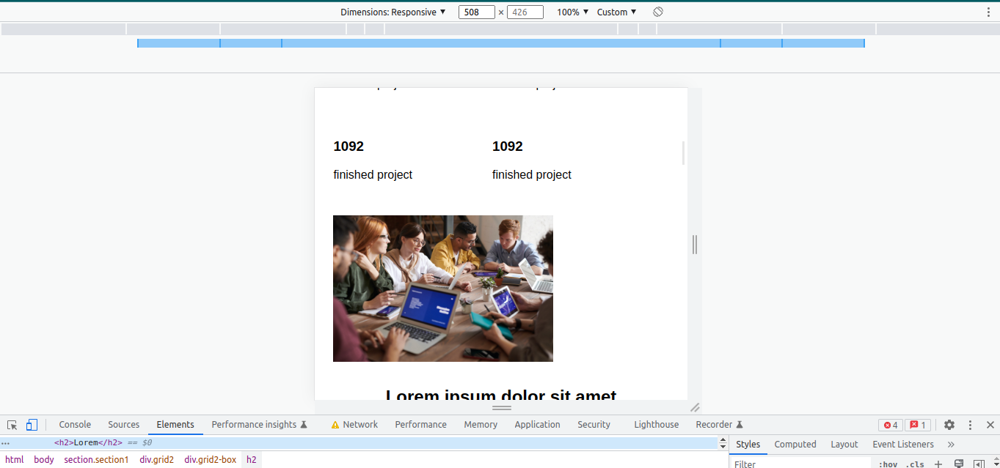
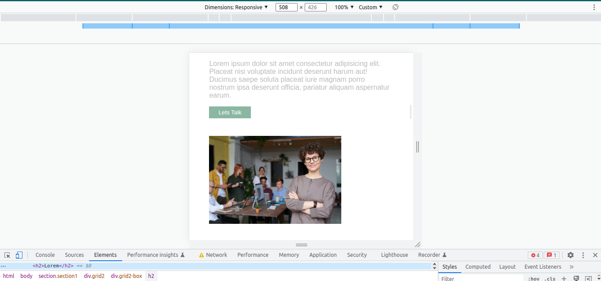
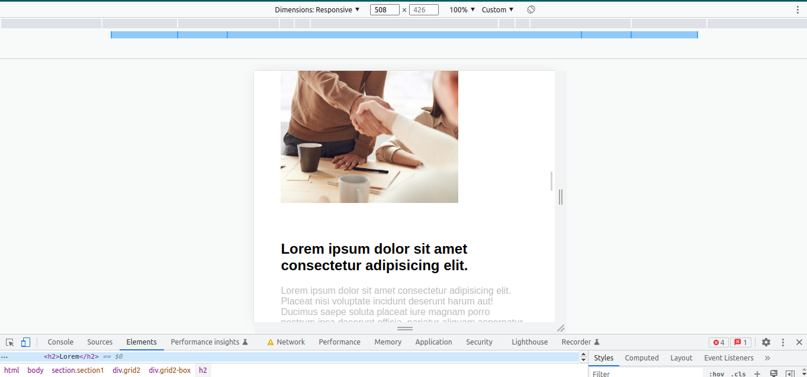
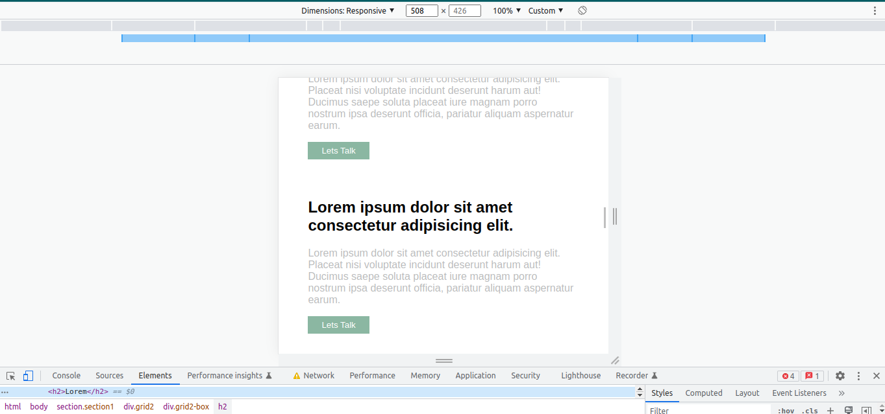
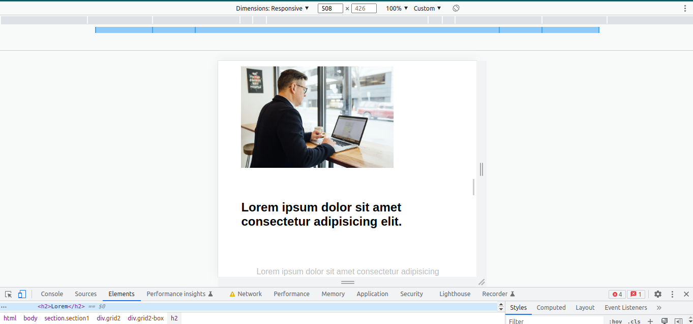

# I am Abhishek Singh
_I am learning Full stack javascript Development_

## This is the assignment that is the part of our live course.
### In this project  I used flex property and used media query to make responsive in all screen size

### This is responsive for all screen size


# Project 11
1. Buisness Landing page 

# Technology used:
1. ```HTML5```
1. ```CSS3```

# Deployed Link
[Netlify Link](https://buisness-landing-pages.netlify.app/)












# Time Taken To Complete This project

_10hours_ 
